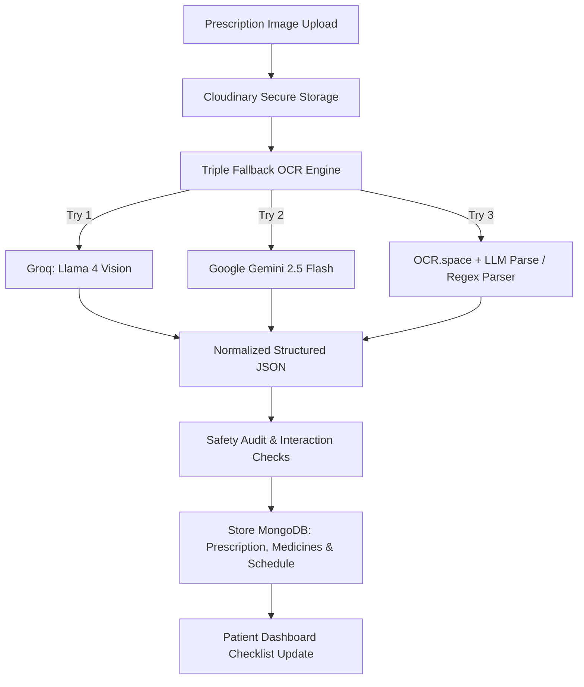
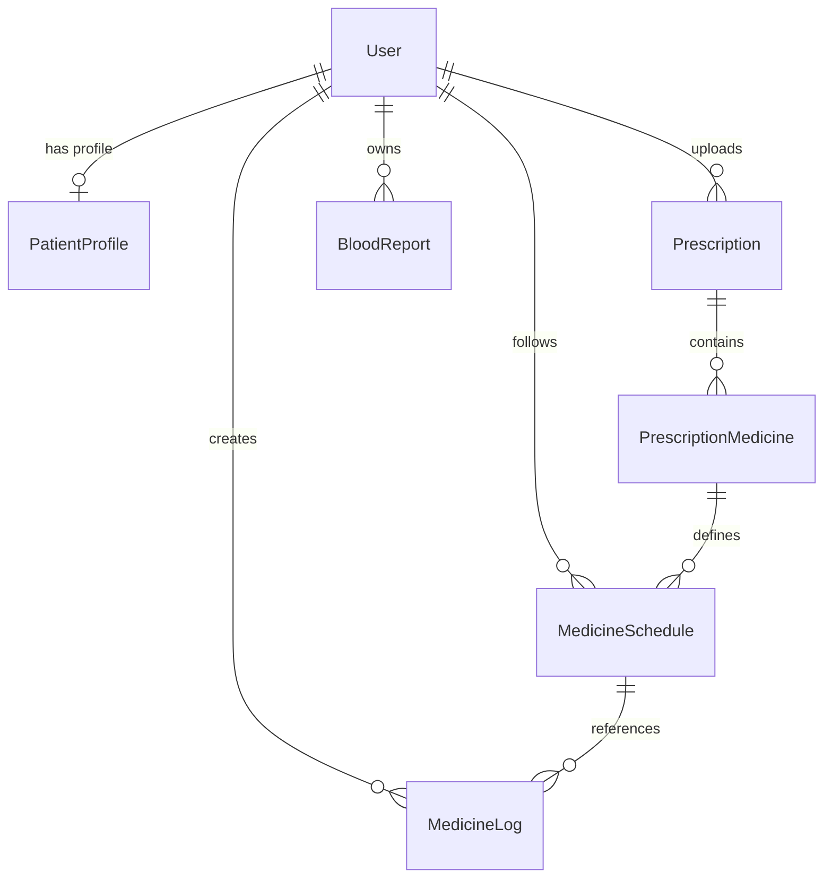

# MediAssist AI 🩺🤖
> **AI-Powered Prescription Digitizer, Medicine Safety Checker & Health Companion**

MediAssist AI is a complete, production-ready healthcare companion web application built on **Next.js**, **React 19**, **Tailwind CSS v4**, and **MongoDB**. It bridges the gap between messy, handwritten clinical prescriptions and patient-safe, structured, digital schedules. By leveraging advanced **Multimodal Vision LLMs** and **Speech Synthesis APIs**, the application automates medical data extraction, safety auditing, biomarker analytics, and patient education.

---
## 📖 Table of Contents
1. [🎥 Demo Video](#-demo-video)
2. [🌟 Core Features](#-core-features)
3. [⚙️ System Architecture & Workflow](#️-system-architecture--workflow)
4. [🧠 Core Algorithms & Clinical NLP Logic](#-core-algorithms--clinical-nlp-logic)
5. [📂 Directory & Project Structure](#-directory--project-structure)
6. [🗄️ Database Schema, Indices & Data Models](#-database-schema-indices--data-models)
7. [🧑‍💻 API Endpoints Reference](#-api-endpoints-reference)
8. [🗣️ Assistant Context & Speech Synthesis (TTS)](#️-assistant-context--speech-synthesis-tts)
9. [🚀 Setup & Installation](#-setup--installation)
10. [🛡️ Health Guardrails & Disclaimer](#️-health-guardrails--disclaimer)

---

## 🎥 Demo Video

Watch the video demonstration of MediAssist AI in action:

<!-- Replace the link below with your actual demo video link or embed a local file -->
[](https://www.youtube.com/watch?v=YOUR_VIDEO_ID)

*Alternative HTML5 Video Embed (if hosted locally, e.g., in `/public/demo.mp4`):*
```html
<video src="/demo.mp4" controls width="100%"></video>
```

---

## 🌟 Core Features

### 1. Multimodal OCR Prescription Digitizer
*   **Handwriting Recognition**: Utilizes advanced vision models to extract complex cursive and handwritten text from prescriptions.
*   **Structured Extraction**: Captures clinical metadata including:
    *   Doctor, Clinic/Hospital, and Patient details.
    *   Vitals (Weight, BP, Pulse, SpO2, Temperature).
    *   Medication tables (Name, Dosage, Instructions, Frequency, and Duration).
    *   Advised diagnostic tests.

### 2. Smart Scheduling & Adherence Tracker
*   **Automatic Split Scheduling**: Translates Latin/medical frequency abbreviations (e.g., *OD*, *BD*, *TDS*, *HS*) into explicit daily schedules (Morning, Afternoon, Evening, Bedtime).
*   **Daily Checklist**: Provides patients with a clean, checkbox-driven daily list to log doses.
*   **Log Management**: Records taken, skipped, and missed medications in a dedicated adherence database for history tracking.

### 3. Patient Safety & Drug Interaction Checker
*   **Drug-Drug Safety Check**: Instantly cross-checks newly uploaded medications for duplicate therapies, contraindicated pairings, and adverse interactions.
*   **AI Risk Scoring**: Classifies prescription safety profiles as `low`, `medium`, `high`, or `critical`.
*   **Predefined Cache**: Accelerates validation using cached medication queries, and stores detailed metadata synced with OpenFDA/RxNorm structures.

### 4. Intelligent Blood Report Analyzer
*   **Biomarker Extraction**: Parses blood test reports (images/PDFs) to extract names, patient values, units, and reference ranges.
*   **Status Labeling**: Determines status (`normal`, `high`, `low`, or `unknown`) by comparing values with standard biological reference ranges.
*   **Actionable Guidance**: Generates biological explanations, overall health summaries, lifestyle/dietary suggestions, and clinical warning flags.

### 5. Multi-lingual Assistant & Text-to-Speech (TTS)
*   **Empathetic Health Chatbot**: A persistent sidebar assistant (powered by Cohere Command-R Plus) loaded with patient-specific medical context.
*   **Context Injection**: Answers patient questions about active prescriptions, schedules, and drug guidelines based on actual database logs.
*   **Bilingual Interface**: Seamlessly speaks and reads in English and Hindi (Devanagari script).
*   **Audio Stitching**: Converts complex AI replies into spoken audio via the Google TTS API.

---

## ⚙️ System Architecture & Workflow

### 🔄 The Prescription Processing Pipeline


1. **Upload**: Users drop images into `react-dropzone`. Files are routed to Next.js API endpoints, converted to base64, and pushed to **Cloudinary**.
2. **Extraction Engine**: System triggers the **Triple Fallback System**:
    *   **Primary**: *Groq Llama 4 Vision* (`llama-4-scout-17b-16e-instruct`) parses structured JSON.
    *   **Secondary**: *Google Gemini 2.5 Flash* (`gemini-2.5-flash`) handles limits and failures.
    *   **Last Resort**: *OCR.space* extracts raw coordinates and strings, then parses details using *Llama 3.3 / Gemini* text queries or regex matches.
3. **Database Insertion**: Saves metadata to `Prescription`, creates individual `PrescriptionMedicine` records, and populates time-of-day rows in `MedicineSchedule`.
4. **Log Interaction**: User clicks checkboxes to log doses, triggering MongoDB updates in `MedicineLog`.

---

## 🧠 Core Algorithms & Clinical NLP Logic

The application implements clinical intelligence strategies to safely translate unstructured medical documents into functional data models.

### 1. Prescription Parsing and Normalization Rules
To handle the ambiguity of handwritten medical texts, the LLM prompt directives enforce the following parser rules:
*   **De-duplication**: Prevents repeating a medication entry. If a medication is written or signed across multiple lines, it groups it into a single entity with its correct total frequency.
*   **Direct Transcription**: Prohibits guessing or approximating medication names. If a handwritten word resembles a signature or artifact, it is discarded.
*   **Cursive Normalization**: Distinguishes cursive loops to prevent false associations (e.g., separating instructions like `"continue"` from actual medicine brand names).
*   **Frequency Expansion**: Standardizes Latin clinical frequency shorthand into daily timing matrices:
    *   `OD` $\rightarrow$ Once a day (Morning)
    *   `BD` / `b.i.d` $\rightarrow$ Twice a day (Morning + Evening)
    *   `TDS` / `t.i.d` $\rightarrow$ Thrice a day (Morning + Afternoon + Evening)
    *   `HS` $\rightarrow$ At bedtime (Night)
    *   `BBF` $\rightarrow$ Before Breakfast (Morning + specific food instruction)
*   **Schedule Splitting**: Maps medications into separate timing slots. For example, a medication marked `BD` is split into two separate records under the `morning` and `evening` schedules in the database.

### 2. Blood Report Biomarker Range Mapping
The biomarker analytics engine parses biochemical metrics (e.g., Hemoglobin, Glucose, Cholesterol, Thyroid Stimulating Hormone, Creatinine) and maps them dynamically:
*   **Reference Range Comparison**: Evaluates values against age/gender-standardized biological ranges.
*   **Status Assignment**: Computes a status label based on the value position:
    *   `low`: The biomarker value lies below the lower boundary of the reference range.
    *   `high`: The biomarker value exceeds the upper boundary of the reference range.
    *   `normal`: The biomarker value falls safely within the reference boundaries.
    *   `unknown`: Assigned if the unit or reference range is illegible or missing.
*   **Biomarker-Specific Recommendations**: For each `high` or `low` status, the AI synthesizes an targeted recommendation addressing that specific biological deficit (e.g., iron-rich dietary recommendations for low hemoglobin).

---

## 📂 Directory & Project Structure

```text
medi/
├── app/
│   ├── (auth)/                # Clerk authentication layouts, sign-in, and sign-up
│   ├── (public)/              # Public promotional pages (Home, Features, How it works, Contact)
│   ├── admin/                 # Admin view layout & administrative modules
│   ├── api/                   # Serverless Backend API routes
│   │   ├── blood-report/      # Uploads and parses patient blood tests
│   │   ├── patient/           # Client dashboard loaders and logs
│   │   │   ├── assistant/     # Endpoint for the chat assistant & TTS audio synthesis
│   │   │   ├── dashboard/     # Retrieves active medicines, logs, and recent uploads
│   │   │   └── medicine-logs/ # Logs medicine intake (taken/missed)
│   │   ├── prescriptions/     # Manages prescription uploads, storage, and OCR workflows
│   │   ├── users/             # Handles onboarding workflows and sync actions
│   │   └── webhooks/          # Svix webhook receiver for Clerk account status synchronization
│   ├── onboarding/            # User role registration and MongoDB sync redirector
│   ├── patient/               # Patient dashboard, blood reports, scheduling, and medicines list
│   ├── layout.tsx             # Root page shell
│   └── page.tsx               # Main public Landing Page
├── components/
│   ├── layout/                # Global layout layouts (AppShell, Navbar, Footer, Sidebar, Topbar)
│   ├── ui/                    # Reusable Tailwind design blocks (buttons, dialogs, charts, data-tables)
│   │   ├── ai-assistant.tsx   # Conversational panel incorporating voice playback triggers
│   │   └── file-upload.tsx    # Drag-and-drop file upload wrapper
│   ├── theme-provider.tsx     # Theme wrapper (Light/Dark mode)
│   └── theme-toggle.tsx       # Mode switching component
├── constants/                 # Immutable definitions (Routes, Roles, and Safety Risk Levels)
├── lib/                       # Core service wrappers (Mongoose db connection, AI assistants, Gemini, Cohere, Cloudinary)
│   ├── ai-blood-report.ts     # Blood test analyzer fallback pipeline
│   ├── ai-prescription.ts     # Prescription parser core engine
│   └── huggingface-tts.ts     # Audio concatenation and Google TTS wrapper
├── models/                    # Mongoose database schemas
└── public/                    # Static UI icons, logos, and illustrations
```

---

## 🗄️ Database Schema, Indices & Data Models

### 📊 Entity-Relationship Diagram


### 🗂️ Mongoose Model Definitions

#### 1. `User`
Stores core identity credentials synced from Clerk.
*   **Fields**: `clerkId` (string, unique), `email` (string), `fullName` (string), `avatarUrl` (string), `role` (`patient`, `admin`), `onboardingCompleted` (boolean).

#### 2. `PatientProfile`
Stores patient-specific clinical metadata.
*   **Fields**: `userId` (ObjectId, ref: `User`, unique), `age` (number), `gender` (string), `allergies` (array of strings), `medicalConditions` (array of strings), `emergencyContact` (nested schema: name, phone, relation).

#### 3. `Prescription`
Stores prescription files, OCR metrics, and analysis results.
*   **Fields**: 
    *   `patientId` (ObjectId, ref: `User`).
    *   `uploadedBy` (ObjectId, ref: `User`).
    *   `file` (nested: url, publicId, type, size).
    *   `ocr` (nested: provider, rawText, cleanedText, confidence, status).
    *   `extractedData` (nested: patientName, doctorName, prescriptionDate, diagnosis, notes, followUpDate).
    *   `risk` (nested: score, level (`low`, `medium`, `high`, `critical`), summary).
    *   `status` (`uploaded`, `processing`, `pending_review`, `approved`, `failed`).
*   **Database Indices**:
    *   `{ patientId: 1, createdAt: -1 }`: Optimizes dashboard page loading and chronologically ordered prescription listings.
    *   `{ uploadedBy: 1 }`: Optimizes user trace logs.
    *   `{ status: 1 }`: Speeds up admin approval queues.

#### 4. `PrescriptionMedicine`
Individual medicines extracted from prescriptions.
*   **Fields**: `prescriptionId` (ObjectId, ref: `Prescription`), `rawText` (string), `medicineName` (string), `normalizedName` (string), `genericName` (string), `rxcui` (string), `strength` (string), `dosage` (string), `frequency` (string), `duration` (string), `instructions` (string), `beforeAfterFood` (`before_food`, `after_food`, `with_food`, `not_specified`).

#### 5. `MedicineSchedule`
Active daily medication requirements.
*   **Fields**: `prescriptionId` (ObjectId), `medicineId` (ObjectId), `patientId` (ObjectId), `medicineName` (string), `dose` (string), `timeOfDay` (`morning`, `afternoon`, `evening`, `night`, `custom`), `exactTime` (string), `instruction` (string), `startDate` (date), `endDate` (date), `status` (`active`, `completed`, `stopped`).
*   **Database Indices**:
    *   `{ patientId: 1, status: 1 }`: Optimizes real-time dashboard scheduling queries.

#### 6. `MedicineLog`
Adherence checker tracker database.
*   **Fields**: `scheduleId` (ObjectId), `patientId` (ObjectId), `status` (`taken`, `missed`, `skipped`), `takenAt` (date), `note` (string).
*   **Database Indices**:
    *   `{ scheduleId: 1 }`: Optimizes adherence calculations.
    *   `{ patientId: 1 }`: Enhances global compliance reviews.

#### 7. `BloodReport`
Analyzed blood biomarker results.
*   **Fields**: `patientId` (ObjectId), `fileUrl` (string), `fileName` (string), `biomarkers` (nested array), `summary` (possibleMeanings, recommendations, whenToConsult).

#### 8. `MedicineCache`
Speeds up medication lookups by caching RxNorm/DailyMed responses.
*   **Fields**: `query` (string, unique), `normalizedName` (string), `genericName` (string), `rxcui` (string), `rxnormData` (mixed), `dailymedData` (mixed), `openfdaData` (mixed), `lastFetchedAt` (date).
*   **Database Indices**:
    *   `{ lastFetchedAt: 1 }` (TTL: `expireAfterSeconds: 30 days`): Automatically purges outdated caches to save storage and ensure medication data correctness.

---

## 🧑‍💻 API Endpoints Reference

### 🔐 Authentication & Sync
*   `POST /api/webhooks/clerk`: Svix webhook receiver. Synchronizes user data (`user.created`, `user.updated`, `user.deleted`) to MongoDB.
*   `POST /api/users/sync`: On-demand user sync API called during frontend mounting.
*   `POST /api/users/onboarding`: Assigns the role to new users and creates an empty `PatientProfile`.

### 📝 Prescriptions
*   `POST /api/prescriptions/upload`: Multi-part form-data handler. Uploads image to Cloudinary, executes the AI OCR pipeline, saves the `Prescription` model, and populates `MedicineSchedule` slots.
*   `GET /api/prescriptions/[id]`: Fetches a prescription's detailed data.

### 🩸 Blood Reports
*   `POST /api/blood-report/upload`: Processes and extracts biomarkers from images/PDFs. Saves results in a `BloodReport` record.
*   `GET /api/blood-report/[id]`: Retrieves a blood report and its parsed biomarker statuses.

### 📅 Patient Logs
*   `GET /api/patient/dashboard`: Loads dashboard details including active medicine counts, recent uploads, and schedule checklists mapped against today's `MedicineLog` records.
*   `POST /api/patient/medicine-logs`: Marks a scheduled medicine dose as `taken` or `missed` for the current calendar date. If a log for today exists, it updates it; otherwise, it creates a new log.

### 💬 Conversational AI Assistant
*   `POST /api/patient/assistant`: Feeds a patient query to Cohere. Generates base64 TTS audio on request.

---

## 🗣️ Assistant Context & Speech Synthesis (TTS)

### 1. Cohere Context Injection
When a patient queries the AI Assistant, the backend constructs a contextual prompt structure to limit hallucinations:
1.  **Retrieve Schedules**: Fetches all active `MedicineSchedule` documents for the user.
2.  **Context Construction**: Formulates a text block:
    ```text
    Patient's active medicines:
    - Metformin (500mg) to be taken in the morning.
    - Atorvastatin (10mg) to be taken in the night.
    ```
3.  **Preamble Framing**: Combines the schedules with system instructions:
    *   Act as *MediAssist AI*, an empathetic healthcare chatbot.
    *   Maintain clinical tone. Keep replies conversational.
    *   Translate into Hindi script if the patient queries in Hindi.
4.  **Generation**: Sends the assembled prompt to Cohere's `command-r-plus-08-2024` model.

### 2. Google TTS Audio Stitching
If the client requests Text-to-Speech playback (`useTts: true`), the backend uses a custom concatenation pipeline:
1.  **Text Chunking**: Google Translate TTS endpoints limit audio requests to short text lengths. The `google-tts-api` helper automatically chunks the reply string using punctuation splitters (`.`, `,`, `?`).
2.  **Parallel Fetch**: Fetches MP3 chunks concurrently from the Google Translate host (`https://translate.google.com`).
3.  **Buffer Allocation**: Calculates the combined length of all fetched `ArrayBuffer` payloads.
4.  **Binary Stitching**: Allocated into a single `Uint8Array` stream:
    ```typescript
    const combined = new Uint8Array(totalLength);
    let offset = 0;
    for (const buf of arrayBuffers) {
      combined.set(new Uint8Array(buf), offset);
      offset += buf.byteLength;
    }
    ```
5.  **Output**: Returns the compiled audio stream as a Base64 string to the frontend, which plays it via the browser's HTML5 Audio context.

---

## 🚀 Setup & Installation

### 1. Configure Local Environment Variables
Create a `.env.local` file in the root directory and configure the following credentials:

```env
# MONGODB
MONGODB_URI=your_mongodb_connection_string

# CLERK AUTHENTICATION
NEXT_PUBLIC_CLERK_PUBLISHABLE_KEY=your_clerk_pub_key
CLERK_SECRET_KEY=your_clerk_secret_key
NEXT_PUBLIC_CLERK_SIGN_IN_URL=/sign-in
NEXT_PUBLIC_CLERK_SIGN_UP_URL=/sign-up
CLERK_WEBHOOK_SECRET=your_clerk_webhook_secret

# CLOUDINARY MEDIA
CLOUDINARY_CLOUD_NAME=your_cloudinary_name
CLOUDINARY_API_KEY=your_cloudinary_api_key
CLOUDINARY_API_SECRET=your_cloudinary_api_secret

# AI PROVIDER API KEYS
GROQ_API_KEY=your_groq_api_key
GEMINI_API_KEY=your_gemini_api_key
COHERE_API_KEY=your_cohere_api_key
OCR_SPACE_API_KEY=your_ocr_space_api_key
```

### 2. Install Dependencies
```bash
npm install
```

### 3. Launch Development Server
```bash
npm run dev
```
Open [http://localhost:3000](http://localhost:3000) to view the application.

---

## 🛡️ Health Guardrails & Disclaimer
> [!IMPORTANT]
> **MediAssist AI is an educational assistant and is not a replacement for professional clinical judgment.** 
> All AI-extracted prescriptions, schedules, and biomarker evaluations should be cross-referenced with your doctor or healthcare provider. Never modify medication doses or treatment plans based solely on the AI output.
